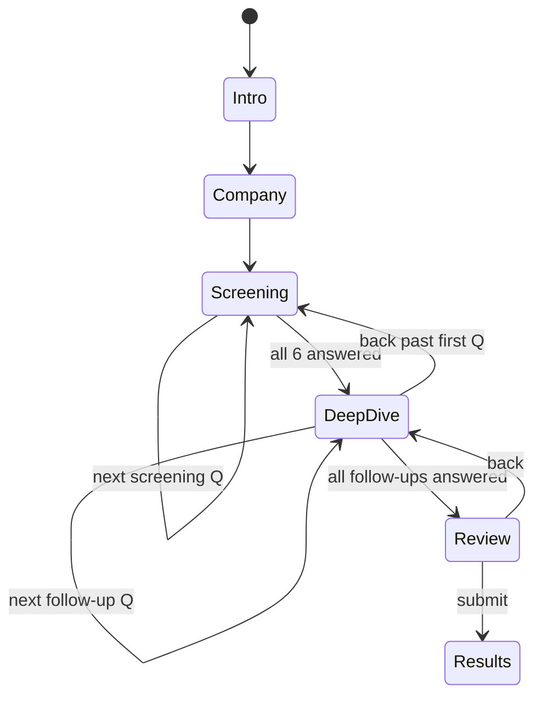

# Adaptive Two-Pass Assessment with Typeform-Style Wizard UX

## Goal

Replace the current dimension-by-dimension assessment flow with an adaptive two-pass system (screening + deep-dive) presented in a Typeform-style one-question-per-screen wizard, reducing effective questions from 48 to ~20-25 for most users while keeping the scoring engine untouched.

## Requirements

- **Typeform-style wizard UX**: Show ONE question at a time with large text, prominent Likert buttons, and a smooth animated progress bar
- **Auto-advance**: After selecting an answer, auto-advance to the next question after a brief delay (~400ms) for visual feedback
- **Back navigation**: Back button to revisit previous questions at any time
- **Keyboard shortcuts** (nice-to-have): 1-5 for Likert answers, left/right arrow keys for back/forward navigation
- **Pass 1 — Screening**: 6 screening questions (1 per dimension, the most general/representative question from each). Show dimension name as context above the question
- **Adaptive level determination**: Based on screening answer per dimension:
  - Score 0-1 → beginner (show ~3 foundational follow-ups)
  - Score 2 → intermediate (show ~5 foundational + intermediate follow-ups)
  - Score 3-4 → advanced (show all 7 remaining follow-ups)
- **Pass 2 — Deep-dive**: Show only the relevant follow-up questions one at a time, grouped by dimension, based on the determined level
- **Difficulty tagging**: Tag each of the 48 questions with a difficulty tier: foundational / intermediate / advanced
- **Scoring compatibility**: Store shape remains `Record<DimensionKey, number[]>` with 8 numbers per dimension. Skipped questions filled with `0`
- **Review step**: Only show answered questions (skip questions that remained at 0 due to adaptive filtering)
- **New step flow**: 0=Intro → 1=Company → 2=Screening → 3=Deep-dive → 4=Review → 5=Results

## Out of scope

- Changes to the scoring engine (`src/lib/scoring/engine.ts`) — remains untouched
- Changes to the scoring types (`src/lib/scoring/types.ts`) — remains untouched
- Changes to the results page (`src/components/results/ResultsPage.tsx`)
- Mobile-specific gestures (swipe navigation)
- Persisting assessment state to localStorage or a backend
- Animation libraries (use CSS transitions only)

## Affected files

| File                                            | Change                                                                                                                                                                                                                                                                                                                |
| ----------------------------------------------- | --------------------------------------------------------------------------------------------------------------------------------------------------------------------------------------------------------------------------------------------------------------------------------------------------------------------- |
| `src/store/assessmentStore.ts`                  | Add adaptive assessment state: `phase` (screening/deepdive), `screeningAnswers`, `adaptiveLevels`, computed question queue, current question index. Change step count from 10 to 6. Add `setScreeningAnswer`, `computeAdaptiveLevels`, `getQuestionQueue` logic. Keep existing `responses` shape and `setAnswer` API. |
| `src/components/assessment/AssessmentShell.tsx` | Replace step 2-7 dimension steps with step 2=ScreeningPhase, step 3=DeepDivePhase. Update step mapping to 6 total steps (0-5).                                                                                                                                                                                        |
| `src/components/assessment/ProgressBar.tsx`     | Replace segmented bar with smooth animated continuous progress bar. Accept `progress` as 0-1 float instead of step number.                                                                                                                                                                                            |
| `src/components/assessment/ReviewStep.tsx`      | Filter display to only show questions that were actually answered (value > 0), grouped by dimension. Show question text alongside each answer.                                                                                                                                                                        |
| `src/components/assessment/IntroStep.tsx`       | Update copy: "takes about 2 minutes" (down from 5) to reflect reduced question count.                                                                                                                                                                                                                                 |
| `src/lib/scoring/questions.ts`                  | Add `SCREENING_QUESTION_INDEX` mapping (which question index per dimension is the screening question) and `QUESTION_TIERS` mapping (difficulty tier per question). Export both. Data only — no logic changes.                                                                                                         |

## New files

| File                                           | Purpose                                                                                                                                                                                                                                                                                           |
| ---------------------------------------------- | ------------------------------------------------------------------------------------------------------------------------------------------------------------------------------------------------------------------------------------------------------------------------------------------------- |
| `src/components/assessment/WizardQuestion.tsx` | Typeform-style single-question view: large question text, dimension label, prominent Likert buttons, auto-advance timer, back button, keyboard shortcut handler                                                                                                                                   |
| `src/components/assessment/ScreeningPhase.tsx` | Orchestrates Pass 1: iterates through 6 screening questions using WizardQuestion, stores answers, computes adaptive levels when complete, then advances to deep-dive                                                                                                                              |
| `src/components/assessment/DeepDivePhase.tsx`  | Orchestrates Pass 2: builds filtered question queue based on adaptive levels, iterates through them using WizardQuestion, writes answers to the store                                                                                                                                             |
| `src/lib/scoring/question-tiers.ts`            | Contains `SCREENING_INDICES` (Record<DimensionKey, number>) and `QUESTION_TIERS` (Record<DimensionKey, Array<'foundational' \| 'intermediate' \| 'advanced'>>), plus `getFollowUpQuestions(dimension, level)` pure function that returns the filtered question indices for a given adaptive level |

## Patterns to mirror

1. **`src/components/assessment/DimensionStep.tsx`** — component structure, Zustand selector pattern, button styling, layout spacing conventions
2. **`src/components/assessment/LikertCard.tsx`** — Likert button rendering pattern, selection styling, aria-label conventions
3. **`src/store/assessmentStore.ts`** — Zustand store shape, `set(state => ...)` update pattern, action interface pattern

## Implementation notes

### Screening question selection

Choose the most general/representative question per dimension (index 0 for each, as these are already the broadest statements):

- strategy[0]: "AI is explicitly part of our company strategy."
- architecture[0]: "We have a central data warehouse with automated ingestion."
- workflow[0]: "Core business processes are AI-assisted."
- data[0]: "Data quality is actively measured and monitored."
- talent[0]: "AI competencies are present across the team, not siloed in one function."
- adoption[0]: "AI tools are used daily by the majority of the team."

### Question difficulty tiers

Each dimension has 8 questions (indices 0-7). Index 0 is the screening question. The remaining 7 (indices 1-7) are tagged:

- **Foundational** (indices 1-3): basic capabilities, present even in beginners
- **Intermediate** (indices 4-5): operational maturity indicators
- **Advanced** (indices 6-7): strategic excellence indicators

Filtering logic per adaptive level:

- Beginner (screening 0-1): foundational only → indices 1, 2, 3 (3 follow-ups)
- Intermediate (screening 2): foundational + intermediate → indices 1, 2, 3, 4, 5 (5 follow-ups)
- Advanced (screening 3-4): all → indices 1, 2, 3, 4, 5, 6, 7 (7 follow-ups)

### Store changes

Add to `AssessmentState`:

```typescript
phase: "screening" | "deepdive" | null;
screeningIndex: number; // 0-5, which screening question we're on
deepDiveQueue: Array<{ dimension: DimensionKey; questionIndex: number }>;
deepDivePosition: number; // current position in the queue
adaptiveLevels: Record<DimensionKey, "beginner" | "intermediate" | "advanced"> |
  null;
```

Add to `AssessmentActions`:

```typescript
setScreeningAnswer: (dimension: DimensionKey, value: number) => void
advanceScreening: () => void    // moves to next screening Q or transitions to deep-dive
computeAdaptiveLevels: () => void
advanceDeepDive: () => void
goBackDeepDive: () => void
goBackScreening: () => void
```

The step count changes: `nextStep`/`prevStep` clamp to 0-5 instead of 0-9.

### Auto-advance behavior

When the user clicks a Likert button in WizardQuestion:

1. Immediately update the answer in the store
2. Show selected state with a brief highlight animation (CSS transition, ~300ms)
3. After 400ms total delay, call the advance callback
4. If the user clicks a different answer during the delay, reset the timer

### Animated progress bar

Replace the segmented ProgressBar with a smooth continuous bar:

- Total questions = 6 (screening) + length of deepDiveQueue (computed after screening)
- During screening: progress = screeningIndex / totalQuestions
- During deep-dive: progress = (6 + deepDivePosition) / totalQuestions
- Use CSS `transition: width 300ms ease` for smooth animation

### Keyboard shortcuts

In WizardQuestion, add a `useEffect` with `keydown` listener:

- Keys `1` through `5` → call onChange with value 0-4 (map key-1 to Likert index)
- `ArrowLeft` or `Backspace` → go back
- `ArrowRight` or `Enter` → go forward (only if current question is answered)
- Clean up listener on unmount

### Writing answers to the store

- Screening answers: `setAnswer(dimension, 0, value)` — screening questions are index 0
- Deep-dive answers: `setAnswer(dimension, questionIndex, value)` — uses the original question index
- Skipped questions remain at their initialized value of 0

### Review step adaptation

Filter the display: for each dimension, iterate `responses[dimension]` and only show entries where `value > 0`. Show the question text from `QUESTIONS[dimension][index]` alongside the Likert label. If all 8 are 0 for a dimension (shouldn't happen since screening guarantees at least 1), show "No questions answered".

### Edge cases

- User goes back from deep-dive to screening: preserve deep-dive answers already given, but recompute the queue if any screening answer changes
- User changes a screening answer: recompute adaptive level for that dimension, rebuild the deep-dive queue. Any deep-dive answers for questions that are now excluded get reset to 0
- All dimensions at beginner: ~6 screening + 18 follow-ups = 24 total questions
- All dimensions at advanced: ~6 screening + 42 follow-ups = 48 total questions (same as current)
- Mixed levels (typical): ~6 + 15-25 = 21-31 total questions

## UX concept

### Component tree

```
AssessmentShell (existing, modified)
├── IntroStep (existing, minor copy change)
├── CompanyStep (existing, unchanged)
├── ScreeningPhase (new)
│   ├── ProgressBar (existing, modified — continuous)
│   └── WizardQuestion (new)
│       └── LikertButton[] (inline, styled after LikertCard)
├── DeepDivePhase (new)
│   ├── ProgressBar (existing, modified)
│   └── WizardQuestion (new, reused)
├── ReviewStep (existing, modified)
└── ResultsPage (existing, unchanged)
```

### Interaction flows

**Screening flow:**

1. User completes Intro → Company → enters Screening (step 2)
2. See first screening question (strategy) with dimension label, large text, 5 Likert buttons
3. Click a Likert button → button highlights → 400ms delay → auto-advance to next screening question
4. Repeat for all 6 dimensions
5. After 6th screening answer, system computes adaptive levels and builds deep-dive queue
6. Auto-transition to Deep-dive phase (step 3)

**Deep-dive flow:**

1. Questions appear one at a time, grouped by dimension (all strategy follow-ups, then architecture, etc.)
2. Dimension label shown above each question for context
3. Same auto-advance behavior as screening
4. Progress bar reflects position within total question count
5. After last deep-dive question, advance to Review (step 4)

**Back navigation:**

1. Back button always visible (except on first screening question, where it goes to Company step)
2. Within screening: goes to previous screening question
3. Within deep-dive: goes to previous deep-dive question
4. At first deep-dive question: back goes to last screening question (re-entering screening phase)
5. From Review: back goes to last deep-dive question



### State & data flow

- **AssessmentShell**: reads `step` from Zustand to render the active phase component
- **ScreeningPhase**: reads `screeningIndex` from store, renders WizardQuestion. On answer, calls `setAnswer(dimension, 0, value)` then `advanceScreening()`
- **DeepDivePhase**: reads `deepDiveQueue` and `deepDivePosition` from store. On answer, calls `setAnswer(dimension, questionIndex, value)` then `advanceDeepDive()`
- **WizardQuestion**: stateless — receives question text, dimension label, current value, onChange, onBack callbacks. Manages only the auto-advance timer as local state (useRef)
- **ProgressBar**: receives `progress` (0-1 float), renders a single animated bar
- **Store**: owns all assessment state. `computeAdaptiveLevels()` derives levels from screening answers (responses[dim][0]) and builds `deepDiveQueue`

### Responsive behavior

- WizardQuestion: question text is `text-2xl md:text-3xl`, Likert buttons stack vertically on `sm` and go horizontal on `md+`
- Max width container remains `max-w-4xl` from AssessmentShell
- Likert buttons are full-width on mobile for easy tap targets (`w-full sm:w-auto`)

### Accessibility

- All Likert buttons have `aria-label` with format "{value} - {label}" (matching existing LikertCard pattern)
- WizardQuestion has `role="group"` with `aria-labelledby` pointing to the question text
- Progress bar has `role="progressbar"` with `aria-valuenow`, `aria-valuemin=0`, `aria-valuemax=100`
- Focus management: when a new question appears, auto-focus the question heading (via ref) so screen readers announce it
- Keyboard shortcuts documented in a visually hidden help text
- Back button is always keyboard-reachable (part of natural tab order)

### Reuse check

- **LikertCard.tsx**: The existing component renders all 5 buttons in a compact card. WizardQuestion needs a larger, more prominent layout — create new inline Likert buttons rather than reusing LikertCard. LikertCard remains for any future use.
- **ProgressBar.tsx**: Modify in place — change from segmented to continuous. No other consumers.
- **LIKERT_LABELS from questions.ts**: Reuse directly for button labels
- **Button styling**: Mirror existing Tailwind button classes from DimensionStep (blue-600 primary, gray-300 outline)

## Validation criteria

1. Starting the assessment shows Intro → Company → first screening question (strategy dimension, one question on screen)
2. Clicking a Likert button highlights it, then auto-advances to the next question after ~400ms
3. After answering all 6 screening questions, the deep-dive phase begins with filtered follow-up questions
4. A user who answers "Not started" (0) on all screening questions sees only foundational follow-ups (~3 per dimension = 18 total deep-dive questions)
5. A user who answers "Fully embedded" (4) on all screening questions sees all 42 follow-up questions
6. The progress bar animates smoothly and reflects actual position across all questions
7. Back button navigates to the previous question; from the first deep-dive question, back returns to the last screening question
8. The Review step shows only questions with non-zero answers, grouped by dimension, with question text visible
9. Submitting from Review produces correct results — the scoring engine receives the standard `Record<DimensionKey, number[]>` with 8 entries per dimension (skipped = 0)
10. Keyboard shortcuts 1-5 select the corresponding Likert value; arrow keys navigate back/forward
11. `DimensionStep.tsx` is no longer imported or used (dead code is acceptable; deletion optional)

## Test cases

1. **Screening stores answers at index 0**: Call `setScreeningAnswer('strategy', 3)` → `responses.strategy[0]` equals `3`
2. **Adaptive level computation — beginner**: Set screening answer to 0 → `adaptiveLevels[dim]` equals `'beginner'`, deepDiveQueue for that dimension contains 3 questions (indices 1-3)
3. **Adaptive level computation — intermediate**: Set screening answer to 2 → `adaptiveLevels[dim]` equals `'intermediate'`, deepDiveQueue for that dimension contains 5 questions (indices 1-5)
4. **Adaptive level computation — advanced**: Set screening answer to 4 → `adaptiveLevels[dim]` equals `'advanced'`, deepDiveQueue for that dimension contains 7 questions (indices 1-7)
5. **Skipped questions remain 0**: After completing an assessment with all beginner levels, `responses.strategy[6]` and `responses.strategy[7]` equal `0`
6. **Total question count — all beginner**: deepDiveQueue length equals 18 (3 per dimension x 6)
7. **Total question count — all advanced**: deepDiveQueue length equals 42 (7 per dimension x 6)
8. **Total question count — mixed**: e.g., 2 beginner + 2 intermediate + 2 advanced → 6 + 10 + 14 = 30
9. **getFollowUpQuestions returns correct indices**: `getFollowUpQuestions('strategy', 'beginner')` returns `[1, 2, 3]`
10. **Scoring engine compatibility**: Build a complete responses object from adaptive flow (with 0s for skipped), pass to `computeResult()` → returns valid `AssessmentResult` without errors
11. **Back navigation recomputes queue**: Change screening answer from 4 to 0 for a dimension → deep-dive questions for that dimension reduced from 7 to 3, any answers at indices 4-7 reset to 0
12. **Auto-advance timer**: (component test) Click Likert button → advance callback fires after delay, not immediately
13. **Review filtering**: Given responses where strategy has [3, 2, 1, 0, 0, 0, 0, 0], Review shows 3 answered questions for strategy (indices 0-2)

## Decisions made by Claude

1. **(low)** Screening questions are index 0 of each dimension — these are the broadest/most general statements. The user could prefer different indices, but index 0 reads as the most representative in all 6 dimensions.
2. **(low)** Question tier assignment: indices 1-3 = foundational, 4-5 = intermediate, 6-7 = advanced. This is a simple positional split. An alternative would be custom per-dimension tagging, but the questions already progress from basic to advanced within each dimension.
3. **(medium)** Auto-advance delay set to 400ms — fast enough to feel responsive, slow enough for visual feedback. Adjustable via constant.
4. **(medium)** Deep-dive questions are grouped by dimension (all strategy follow-ups, then architecture, etc.) rather than interleaved. This gives the user mental context continuity.
5. **(low)** New file `question-tiers.ts` created separately from `questions.ts` to avoid modifying a pure data file with logic. The tier data and filtering function are co-located.
6. **(medium)** When a screening answer changes and the adaptive level drops (e.g., advanced → beginner), answers for now-excluded questions are reset to 0. This prevents stale answers from affecting scores.
7. **(low)** WizardQuestion does not reuse LikertCard — it needs a fundamentally different layout (large centered, full-width buttons vs. compact inline chips). Creating new styled buttons avoids contorting the existing component.
